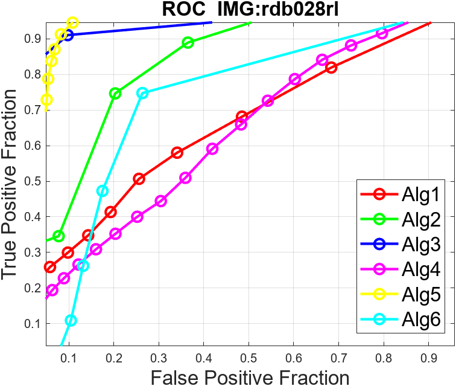

<body> 
 <h2 class="titleHead">Evaluation of CAD Algorithms</h2> 
Mohamed Ahmed Abdullah Mahmoud Mustafa
  
March 5, 2023
 
 <h3 class="likesectionHead">Introduction</h3> <!--l. 30-->
The program evaluates and tests some algorithms and finds the best evaluation measure for it with different photos. <!--l. 32-->
 <h3 class="likesectionHead">The ROC Curves for All 4 Images</h3> <!--l. 34-->

 
 <!--l. 36-->
<!--l. 37-->
  
(a) 
 
 
 
 
  
(b) 
 
 
 <!--l. 48-->
<!--l. 49-->
  
(c) 
 
 
 <!--l. 53-->
<!--l. 54-->
  
(d) 
 
   
Figure&#x00A0;1: R.O.C. for 4 images 
 <!--l. 61-->

 <h3 class="likesectionHead">The Results of the 2D Evaluation [?] [?]</h3> 
 <!--l. 69-->
 

 
 <table id="TBL-2" class="tabular" ><colgroup id="TBL-2-1g"><col id="TBL-2-1"></colgroup><colgroup id="TBL-2-2g"><col id="TBL-2-2"></colgroup><colgroup id="TBL-2-3g"><col id="TBL-2-3"></colgroup><colgroup id="TBL-2-4g"><col id="TBL-2-4"></colgroup><colgroup id="TBL-2-5g"><col id="TBL-2-5"></colgroup><colgroup id="TBL-2-6g"><col id="TBL-2-6"></colgroup><colgroup id="TBL-2-7g"><col id="TBL-2-7"></colgroup><tr class="hline"><td>
</td><td>
</td><td>
</td><td>
</td><td>
</td><td>
</td><td>
</td></tr><tr style="vertical-align:baseline;" id="TBL-2-1-"><td style="white-space:nowrap; text-align:center;" id="TBL-2-1-1" class="td11"> </td><td style="white-space:nowrap; text-align:center;" id="TBL-2-1-2" class="td11"> Alg1 </td><td style="white-space:nowrap; text-align:center;" id="TBL-2-1-3" class="td11"> Alg2 </td><td style="white-space:nowrap; text-align:center;" id="TBL-2-1-4" class="td11"> Alg3 </td><td style="white-space:nowrap; text-align:center;" id="TBL-2-1-5" class="td11"> Alg4 </td><td style="white-space:nowrap; text-align:center;" id="TBL-2-1-6" class="td11"> Alg5 </td><td style="white-space:nowrap; text-align:center;" id="TBL-2-1-7" class="td11"> Alg6 </td> </tr><tr class="hline"><td>
</td><td>
</td><td>
</td><td>
</td><td>
</td><td>
</td><td>
</td></tr><tr style="vertical-align:baseline;" id="TBL-2-2-"><td style="white-space:nowrap; text-align:center;" id="TBL-2-2-1" class="td11">Area Under the curve</td><td style="white-space:nowrap; text-align:center;" id="TBL-2-2-2" class="td11">0.7122</td><td style="white-space:nowrap; text-align:center;" id="TBL-2-2-3" class="td11"> 0.8002 </td><td style="white-space:nowrap; text-align:center;" id="TBL-2-2-4" class="td11">0.9587</td><td style="white-space:nowrap; text-align:center;" id="TBL-2-2-5" class="td11"> 0.7888 </td><td style="white-space:nowrap; text-align:center;" id="TBL-2-2-6" class="td11">0.9340</td><td style="white-space:nowrap; text-align:center;" id="TBL-2-2-7" class="td11">0.7862</td></tr><tr class="hline"><td>
</td><td>
</td><td>
</td><td>
</td><td>
</td><td>
</td><td>
</td></tr><tr style="vertical-align:baseline;" id="TBL-2-3-"><td style="white-space:nowrap; text-align:center;" id="TBL-2-3-1" class="td11"> Jaccard </td><td style="white-space:nowrap; text-align:center;" id="TBL-2-3-2" class="td11">0.1419</td><td style="white-space:nowrap; text-align:center;" id="TBL-2-3-3" class="td11"> 0.0440 </td><td style="white-space:nowrap; text-align:center;" id="TBL-2-3-4" class="td11">0.7257</td><td style="white-space:nowrap; text-align:center;" id="TBL-2-3-5" class="td11"> 0.1230 </td><td style="white-space:nowrap; text-align:center;" id="TBL-2-3-6" class="td11">0.2844</td><td style="white-space:nowrap; text-align:center;" id="TBL-2-3-7" class="td11">0.0752</td> </tr><tr class="hline"><td>
</td><td>
</td><td>
</td><td>
</td><td>
</td><td>
</td><td>
</td></tr><tr style="vertical-align:baseline;" id="TBL-2-4-"><td style="white-space:nowrap; text-align:center;" id="TBL-2-4-1" class="td11"> Dice </td><td style="white-space:nowrap; text-align:center;" id="TBL-2-4-2" class="td11">0.2485</td><td style="white-space:nowrap; text-align:center;" id="TBL-2-4-3" class="td11"> 0.0843 </td><td style="white-space:nowrap; text-align:center;" id="TBL-2-4-4" class="td11">0.8410</td><td style="white-space:nowrap; text-align:center;" id="TBL-2-4-5" class="td11"> 0.2191 </td><td style="white-space:nowrap; text-align:center;" id="TBL-2-4-6" class="td11">0.4429</td><td style="white-space:nowrap; text-align:center;" id="TBL-2-4-7" class="td11">0.1400</td> </tr><tr class="hline"><td>
</td><td>
</td><td>
</td><td>
</td><td>
</td><td>
</td><td>
</td></tr><tr style="vertical-align:baseline;" id="TBL-2-5-"><td style="white-space:nowrap; text-align:center;" id="TBL-2-5-1" class="td11"> Hausdorff Distance </td><td style="white-space:nowrap; text-align:center;" id="TBL-2-5-2" class="td11">9.2736</td><td style="white-space:nowrap; text-align:center;" id="TBL-2-5-3" class="td11">13.5647</td><td style="white-space:nowrap; text-align:center;" id="TBL-2-5-4" class="td11">4.4721</td><td style="white-space:nowrap; text-align:center;" id="TBL-2-5-5" class="td11">10.0995</td><td style="white-space:nowrap; text-align:center;" id="TBL-2-5-6" class="td11">5.7446</td><td style="white-space:nowrap; text-align:center;" id="TBL-2-5-7" class="td11">9.7980</td> </tr><tr class="hline"><td>
</td><td>
</td><td>
</td><td>
</td><td>
</td><td>
</td><td>
</td></tr><tr style="vertical-align:baseline;" id="TBL-2-6-"><td style="white-space:nowrap; text-align:center;" id="TBL-2-6-1" class="td11"> </td></tr></table>
    
 Table&#x00A0;1:  2D Evaluation for rdb005ll.png 
<!--tex4ht:label?: x1-3001r --> 

 
 <!--l. 87-->
 The best algorithm as <a href="#x1-3001r1">1<!--tex4ht:ref: tab:2d_evaluation1 --></a> shows is Alg3 because its AUC is larger than AUC of other algorithms, in addition to Jaccard and Dice similarity, and the Hausdorff Distance is smaller than other algorithms. 
 <!--l. 89-->
 

 
 <table id="TBL-3" class="tabular" ><colgroup id="TBL-3-1g"><col id="TBL-3-1"></colgroup><colgroup id="TBL-3-2g"><col id="TBL-3-2"></colgroup><colgroup id="TBL-3-3g"><col id="TBL-3-3"></colgroup><colgroup id="TBL-3-4g"><col id="TBL-3-4"></colgroup><colgroup id="TBL-3-5g"><col id="TBL-3-5"></colgroup><colgroup id="TBL-3-6g"><col id="TBL-3-6"></colgroup><colgroup id="TBL-3-7g"><col id="TBL-3-7"></colgroup><tr class="hline"><td>
</td><td>
</td><td>
</td><td>
</td><td>
</td><td>
</td><td>
</td></tr><tr style="vertical-align:baseline;" id="TBL-3-1-"><td style="white-space:nowrap; text-align:center;" id="TBL-3-1-1" class="td11"> </td><td style="white-space:nowrap; text-align:center;" id="TBL-3-1-2" class="td11"> Alg1 </td><td style="white-space:nowrap; text-align:center;" id="TBL-3-1-3" class="td11"> Alg2 </td><td style="white-space:nowrap; text-align:center;" id="TBL-3-1-4" class="td11"> Alg3 </td><td style="white-space:nowrap; text-align:center;" id="TBL-3-1-5" class="td11"> Alg4 </td><td style="white-space:nowrap; text-align:center;" id="TBL-3-1-6" class="td11"> Alg5 </td><td style="white-space:nowrap; text-align:center;" id="TBL-3-1-7" class="td11"> Alg6 </td> </tr><tr class="hline"><td>
</td><td>
</td><td>
</td><td>
</td><td>
</td><td>
</td><td>
</td></tr><tr style="vertical-align:baseline;" id="TBL-3-2-"><td style="white-space:nowrap; text-align:center;" id="TBL-3-2-1" class="td11">Area Under the curve</td><td style="white-space:nowrap; text-align:center;" id="TBL-3-2-2" class="td11"> 0.3459 </td><td style="white-space:nowrap; text-align:center;" id="TBL-3-2-3" class="td11">0.9390</td><td style="white-space:nowrap; text-align:center;" id="TBL-3-2-4" class="td11"> 0.0 </td><td style="white-space:nowrap; text-align:center;" id="TBL-3-2-5" class="td11"> 0.8143 </td><td style="white-space:nowrap; text-align:center;" id="TBL-3-2-6" class="td11"> 0.0 </td><td style="white-space:nowrap; text-align:center;" id="TBL-3-2-7" class="td11"> 0.7816 </td></tr><tr class="hline"><td>
</td><td>
</td><td>
</td><td>
</td><td>
</td><td>
</td><td>
</td></tr><tr style="vertical-align:baseline;" id="TBL-3-3-"><td style="white-space:nowrap; text-align:center;" id="TBL-3-3-1" class="td11"> Jaccard </td><td style="white-space:nowrap; text-align:center;" id="TBL-3-3-2" class="td11"> 0.0008 </td><td style="white-space:nowrap; text-align:center;" id="TBL-3-3-3" class="td11">0.1092</td><td style="white-space:nowrap; text-align:center;" id="TBL-3-3-4" class="td11"> 0.0 </td><td style="white-space:nowrap; text-align:center;" id="TBL-3-3-5" class="td11"> 0.0913 </td><td style="white-space:nowrap; text-align:center;" id="TBL-3-3-6" class="td11"> 0.0 </td><td style="white-space:nowrap; text-align:center;" id="TBL-3-3-7" class="td11">0.0331</td> </tr><tr class="hline"><td>
</td><td>
</td><td>
</td><td>
</td><td>
</td><td>
</td><td>
</td></tr><tr style="vertical-align:baseline;" id="TBL-3-4-"><td style="white-space:nowrap; text-align:center;" id="TBL-3-4-1" class="td11"> Dice </td><td style="white-space:nowrap; text-align:center;" id="TBL-3-4-2" class="td11"> 0.0015 </td><td style="white-space:nowrap; text-align:center;" id="TBL-3-4-3" class="td11">0.1968</td><td style="white-space:nowrap; text-align:center;" id="TBL-3-4-4" class="td11"> 0.0 </td><td style="white-space:nowrap; text-align:center;" id="TBL-3-4-5" class="td11"> 0.1673 </td><td style="white-space:nowrap; text-align:center;" id="TBL-3-4-6" class="td11"> 0.0 </td><td style="white-space:nowrap; text-align:center;" id="TBL-3-4-7" class="td11"> 0.0641 </td> </tr><tr class="hline"><td>
</td><td>
</td><td>
</td><td>
</td><td>
</td><td>
</td><td>
</td></tr><tr style="vertical-align:baseline;" id="TBL-3-5-"><td style="white-space:nowrap; text-align:center;" id="TBL-3-5-1" class="td11"> Hausdorff Distance </td><td style="white-space:nowrap; text-align:center;" id="TBL-3-5-2" class="td11">11.4018</td><td style="white-space:nowrap; text-align:center;" id="TBL-3-5-3" class="td11"> 9.7468 </td><td style="white-space:nowrap; text-align:center;" id="TBL-3-5-4" class="td11">7.6811</td><td style="white-space:nowrap; text-align:center;" id="TBL-3-5-5" class="td11">10.3441</td><td style="white-space:nowrap; text-align:center;" id="TBL-3-5-6" class="td11">7.6811</td><td style="white-space:nowrap; text-align:center;" id="TBL-3-5-7" class="td11">12.6886</td> </tr><tr class="hline"><td>
</td><td>
</td><td>
</td><td>
</td><td>
</td><td>
</td><td>
</td></tr><tr style="vertical-align:baseline;" id="TBL-3-6-"><td style="white-space:nowrap; text-align:center;" id="TBL-3-6-1" class="td11"> </td></tr></table>
    
 Table&#x00A0;2:  2D Evaluation for rdb023ll.png 
<!--tex4ht:label?: x1-3003r --> 

 
 <!--l. 107-->
 The best algorithm as <a href="#x1-3003r2">2<!--tex4ht:ref: tab:2d_evaluation2 --></a> shows is Alg2 because its AUC is larger than the AUC of other algorithms. 
 <!--l. 109-->
 

 
 <table id="TBL-4" class="tabular" ><colgroup id="TBL-4-1g"><col id="TBL-4-1"></colgroup><colgroup id="TBL-4-2g"><col id="TBL-4-2"></colgroup><colgroup id="TBL-4-3g"><col id="TBL-4-3"></colgroup><colgroup id="TBL-4-4g"><col id="TBL-4-4"></colgroup><colgroup id="TBL-4-5g"><col id="TBL-4-5"></colgroup><colgroup id="TBL-4-6g"><col id="TBL-4-6"></colgroup><colgroup id="TBL-4-7g"><col id="TBL-4-7"></colgroup><tr class="hline"><td>
</td><td>
</td><td>
</td><td>
</td><td>
</td><td>
</td><td>
</td></tr><tr style="vertical-align:baseline;" id="TBL-4-1-"><td style="white-space:nowrap; text-align:center;" id="TBL-4-1-1" class="td11"> </td><td style="white-space:nowrap; text-align:center;" id="TBL-4-1-2" class="td11"> Alg1 </td><td style="white-space:nowrap; text-align:center;" id="TBL-4-1-3" class="td11"> Alg2 </td><td style="white-space:nowrap; text-align:center;" id="TBL-4-1-4" class="td11"> Alg3 </td><td style="white-space:nowrap; text-align:center;" id="TBL-4-1-5" class="td11"> Alg4 </td><td style="white-space:nowrap; text-align:center;" id="TBL-4-1-6" class="td11"> Alg5 </td><td style="white-space:nowrap; text-align:center;" id="TBL-4-1-7" class="td11"> Alg6 </td> </tr><tr class="hline"><td>
</td><td>
</td><td>
</td><td>
</td><td>
</td><td>
</td><td>
</td></tr><tr style="vertical-align:baseline;" id="TBL-4-2-"><td style="white-space:nowrap; text-align:center;" id="TBL-4-2-1" class="td11">Area Under the curve</td><td style="white-space:nowrap; text-align:center;" id="TBL-4-2-2" class="td11"> 0.7133 </td><td style="white-space:nowrap; text-align:center;" id="TBL-4-2-3" class="td11"> 0.7701 </td><td style="white-space:nowrap; text-align:center;" id="TBL-4-2-4" class="td11"> 0.8364 </td><td style="white-space:nowrap; text-align:center;" id="TBL-4-2-5" class="td11"> 0.6439 </td><td style="white-space:nowrap; text-align:center;" id="TBL-4-2-6" class="td11">0.9630</td><td style="white-space:nowrap; text-align:center;" id="TBL-4-2-7" class="td11"> 0.7726 </td></tr><tr class="hline"><td>
</td><td>
</td><td>
</td><td>
</td><td>
</td><td>
</td><td>
</td></tr><tr style="vertical-align:baseline;" id="TBL-4-3-"><td style="white-space:nowrap; text-align:center;" id="TBL-4-3-1" class="td11"> Jaccard </td><td style="white-space:nowrap; text-align:center;" id="TBL-4-3-2" class="td11">0.4684</td><td style="white-space:nowrap; text-align:center;" id="TBL-4-3-3" class="td11"> 0.0626 </td><td style="white-space:nowrap; text-align:center;" id="TBL-4-3-4" class="td11"> 0.3479 </td><td style="white-space:nowrap; text-align:center;" id="TBL-4-3-5" class="td11"> 0.1013 </td><td style="white-space:nowrap; text-align:center;" id="TBL-4-3-6" class="td11"> 0.4280 </td><td style="white-space:nowrap; text-align:center;" id="TBL-4-3-7" class="td11"> 0.1070</td> </tr><tr class="hline"><td>
</td><td>
</td><td>
</td><td>
</td><td>
</td><td>
</td><td>
</td></tr><tr style="vertical-align:baseline;" id="TBL-4-4-"><td style="white-space:nowrap; text-align:center;" id="TBL-4-4-1" class="td11"> Dice </td><td style="white-space:nowrap; text-align:center;" id="TBL-4-4-2" class="td11">0.6380</td><td style="white-space:nowrap; text-align:center;" id="TBL-4-4-3" class="td11"> 0.1179 </td><td style="white-space:nowrap; text-align:center;" id="TBL-4-4-4" class="td11"> 0.5162 </td><td style="white-space:nowrap; text-align:center;" id="TBL-4-4-5" class="td11"> 0.1839 </td><td style="white-space:nowrap; text-align:center;" id="TBL-4-4-6" class="td11"> 0.5994 </td><td style="white-space:nowrap; text-align:center;" id="TBL-4-4-7" class="td11"> 0.1933 </td> </tr><tr class="hline"><td>
</td><td>
</td><td>
</td><td>
</td><td>
</td><td>
</td><td>
</td></tr><tr style="vertical-align:baseline;" id="TBL-4-5-"><td style="white-space:nowrap; text-align:center;" id="TBL-4-5-1" class="td11"> Hausdorff Distance </td><td style="white-space:nowrap; text-align:center;" id="TBL-4-5-2" class="td11">7.9373</td><td style="white-space:nowrap; text-align:center;" id="TBL-4-5-3" class="td11">17.4642</td><td style="white-space:nowrap; text-align:center;" id="TBL-4-5-4" class="td11">11.1803</td><td style="white-space:nowrap; text-align:center;" id="TBL-4-5-5" class="td11">11.9164</td><td style="white-space:nowrap; text-align:center;" id="TBL-4-5-6" class="td11"> 8.3066 </td><td style="white-space:nowrap; text-align:center;" id="TBL-4-5-7" class="td11">14.5945</td> </tr><tr class="hline"><td>
</td><td>
</td><td>
</td><td>
</td><td>
</td><td>
</td><td>
</td></tr><tr style="vertical-align:baseline;" id="TBL-4-6-"><td style="white-space:nowrap; text-align:center;" id="TBL-4-6-1" class="td11"> </td></tr></table>
    
 Table&#x00A0;3:  2D Evaluation for rdb025ll.png 
<!--tex4ht:label?: x1-3005r --> 

 
 <!--l. 127-->
 The best algorithm as <a href="#x1-3005r3">3<!--tex4ht:ref: tab:2d_evaluation3 --></a> shows is Alg5 because its AUC is larger than the AUC of other algorithms, in addition to its Jaccard and Dice distances is a 2nd smaller distance. 
 <!--l. 130-->
 

 
 <table id="TBL-5" class="tabular" ><colgroup id="TBL-5-1g"><col id="TBL-5-1"></colgroup><colgroup id="TBL-5-2g"><col id="TBL-5-2"></colgroup><colgroup id="TBL-5-3g"><col id="TBL-5-3"></colgroup><colgroup id="TBL-5-4g"><col id="TBL-5-4"></colgroup><colgroup id="TBL-5-5g"><col id="TBL-5-5"></colgroup><colgroup id="TBL-5-6g"><col id="TBL-5-6"></colgroup><colgroup id="TBL-5-7g"><col id="TBL-5-7"></colgroup><tr class="hline"><td>
</td><td>
</td><td>
</td><td>
</td><td>
</td><td>
</td><td>
</td></tr><tr style="vertical-align:baseline;" id="TBL-5-1-"><td style="white-space:nowrap; text-align:center;" id="TBL-5-1-1" class="td11"> </td><td style="white-space:nowrap; text-align:center;" id="TBL-5-1-2" class="td11"> Alg1 </td><td style="white-space:nowrap; text-align:center;" id="TBL-5-1-3" class="td11"> Alg2 </td><td style="white-space:nowrap; text-align:center;" id="TBL-5-1-4" class="td11"> Alg3 </td><td style="white-space:nowrap; text-align:center;" id="TBL-5-1-5" class="td11"> Alg4 </td><td style="white-space:nowrap; text-align:center;" id="TBL-5-1-6" class="td11"> Alg5 </td><td style="white-space:nowrap; text-align:center;" id="TBL-5-1-7" class="td11"> Alg6 </td> </tr><tr class="hline"><td>
</td><td>
</td><td>
</td><td>
</td><td>
</td><td>
</td><td>
</td></tr><tr style="vertical-align:baseline;" id="TBL-5-2-"><td style="white-space:nowrap; text-align:center;" id="TBL-5-2-1" class="td11">Area Under the curve</td><td style="white-space:nowrap; text-align:center;" id="TBL-5-2-2" class="td11">0.6599</td><td style="white-space:nowrap; text-align:center;" id="TBL-5-2-3" class="td11"> 0.8419 </td><td style="white-space:nowrap; text-align:center;" id="TBL-5-2-4" class="td11"> 0.9485 </td><td style="white-space:nowrap; text-align:center;" id="TBL-5-2-5" class="td11">0.6356</td><td style="white-space:nowrap; text-align:center;" id="TBL-5-2-6" class="td11">0.9588</td><td style="white-space:nowrap; text-align:center;" id="TBL-5-2-7" class="td11"> 0.7205 </td></tr><tr class="hline"><td>
</td><td>
</td><td>
</td><td>
</td><td>
</td><td>
</td><td>
</td></tr><tr style="vertical-align:baseline;" id="TBL-5-3-"><td style="white-space:nowrap; text-align:center;" id="TBL-5-3-1" class="td11"> Jaccard </td><td style="white-space:nowrap; text-align:center;" id="TBL-5-3-2" class="td11">0.3297</td><td style="white-space:nowrap; text-align:center;" id="TBL-5-3-3" class="td11"> 0.0828 </td><td style="white-space:nowrap; text-align:center;" id="TBL-5-3-4" class="td11">0.7260</td><td style="white-space:nowrap; text-align:center;" id="TBL-5-3-5" class="td11">0.2491</td><td style="white-space:nowrap; text-align:center;" id="TBL-5-3-6" class="td11"> 0.5248 </td><td style="white-space:nowrap; text-align:center;" id="TBL-5-3-7" class="td11"> 0.0983</td> </tr><tr class="hline"><td>
</td><td>
</td><td>
</td><td>
</td><td>
</td><td>
</td><td>
</td></tr><tr style="vertical-align:baseline;" id="TBL-5-4-"><td style="white-space:nowrap; text-align:center;" id="TBL-5-4-1" class="td11"> Dice </td><td style="white-space:nowrap; text-align:center;" id="TBL-5-4-2" class="td11">0.4959</td><td style="white-space:nowrap; text-align:center;" id="TBL-5-4-3" class="td11"> 0.1529 </td><td style="white-space:nowrap; text-align:center;" id="TBL-5-4-4" class="td11">0.8412</td><td style="white-space:nowrap; text-align:center;" id="TBL-5-4-5" class="td11">0.3988</td><td style="white-space:nowrap; text-align:center;" id="TBL-5-4-6" class="td11"> 0.6884 </td><td style="white-space:nowrap; text-align:center;" id="TBL-5-4-7" class="td11"> 0.1791 </td> </tr><tr class="hline"><td>
</td><td>
</td><td>
</td><td>
</td><td>
</td><td>
</td><td>
</td></tr><tr style="vertical-align:baseline;" id="TBL-5-5-"><td style="white-space:nowrap; text-align:center;" id="TBL-5-5-1" class="td11"> Hausdorff Distance </td><td style="white-space:nowrap; text-align:center;" id="TBL-5-5-2" class="td11">8.0000</td><td style="white-space:nowrap; text-align:center;" id="TBL-5-5-3" class="td11">16.0624</td><td style="white-space:nowrap; text-align:center;" id="TBL-5-5-4" class="td11"> 6.2450 </td><td style="white-space:nowrap; text-align:center;" id="TBL-5-5-5" class="td11">9.4868</td><td style="white-space:nowrap; text-align:center;" id="TBL-5-5-6" class="td11">6.0828</td><td style="white-space:nowrap; text-align:center;" id="TBL-5-5-7" class="td11">12.6095</td> </tr><tr class="hline"><td>
</td><td>
</td><td>
</td><td>
</td><td>
</td><td>
</td><td>
</td></tr><tr style="vertical-align:baseline;" id="TBL-5-6-"><td style="white-space:nowrap; text-align:center;" id="TBL-5-6-1" class="td11"> </td></tr></table>
    
 Table&#x00A0;4:  2D Evaluation for rdb028rl.png 
<!--tex4ht:label?: x1-3007r --> 

 
 <!--l. 148-->
 The best algorithm as <a href="#x1-3007r4">4<!--tex4ht:ref: tab:2d_evaluation4 --></a> shows is Alg5 because its AUC is larger than the AUC of other algorithms, in addition to its Jaccard and Dice distances is a 2nd smaller distance. <h3 class="likesectionHead">The Results of the 3D Evaluation</h3> 
 <!--l. 156-->
 

 
 <table id="TBL-6" class="tabular" ><colgroup id="TBL-6-1g"><col id="TBL-6-1"></colgroup><colgroup id="TBL-6-2g"><col id="TBL-6-2"></colgroup><colgroup id="TBL-6-3g"><col id="TBL-6-3"></colgroup><colgroup id="TBL-6-4g"><col id="TBL-6-4"></colgroup><tr class="hline"><td>
</td><td>
</td><td>
</td><td>
</td></tr><tr style="vertical-align:baseline;" id="TBL-6-1-"><td style="white-space:nowrap; text-align:center;" id="TBL-6-1-1" class="td11"> </td><td style="white-space:nowrap; text-align:center;" id="TBL-6-1-2" class="td11">Jaccard Index Mean</td><td style="white-space:nowrap; text-align:center;" id="TBL-6-1-3" class="td11">Dice Index Mean</td><td style="white-space:nowrap; text-align:center;" id="TBL-6-1-4" class="td11">Hausdorff Distance Mean</td> </tr><tr class="hline"><td>
</td><td>
</td><td>
</td><td>
</td></tr><tr style="vertical-align:baseline;" id="TBL-6-2-"><td style="white-space:nowrap; text-align:center;" id="TBL-6-2-1" class="td11">Measures</td><td style="white-space:nowrap; text-align:center;" id="TBL-6-2-2" class="td11"> 0.2171 </td><td style="white-space:nowrap; text-align:center;" id="TBL-6-2-3" class="td11"> 0.2869 </td><td style="white-space:nowrap; text-align:center;" id="TBL-6-2-4" class="td11"> 1.4502 </td> </tr><tr class="hline"><td>
</td><td>
</td><td>
</td><td>
</td></tr><tr style="vertical-align:baseline;" id="TBL-6-3-"><td style="white-space:nowrap; text-align:center;" id="TBL-6-3-1" class="td11"> </td></tr></table> 
     
 Table&#x00A0;5:  3D Evaluation 
<!--tex4ht:label?: x1-4001r --> 

 
 <h3 class="likesectionHead">The Best Evaluation Measure</h3> <!--l. 171-->
It depends on the input Data-set, There is no evaluation measure that is best for all cases, but each measure has some advantages and some disadvantages, and in general, the engineer must make a trade-off according to the application that he is about to evaluate. <!--l. 174-->
 <h3 class="likesectionHead">The Troubles I Have Encountered</h3> <ul class="itemize1"> <li class="itemize"> <!--l. 177-->
Dealing With Notebook in Matlab, the performance is prolonged. </li> <li class="itemize"> <!--l. 178-->
Can&#8217;t use built-in trapezoid function in Matlab. </li> <li class="itemize"> <!--l. 179-->
Calculating Confusion Matrix parameters for 3D evaluation in one line.</li></ul>
</body>
