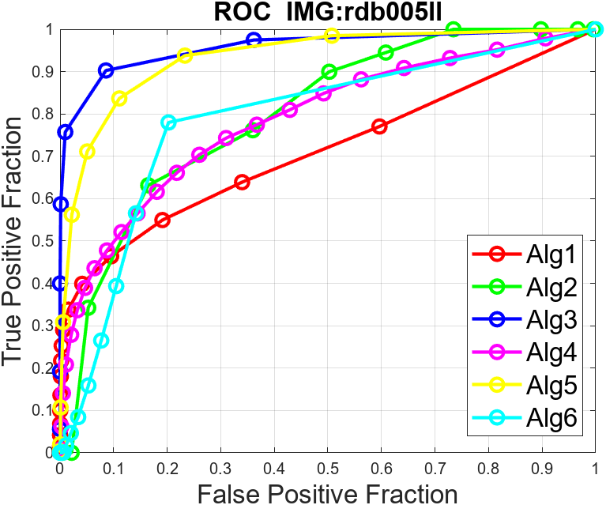
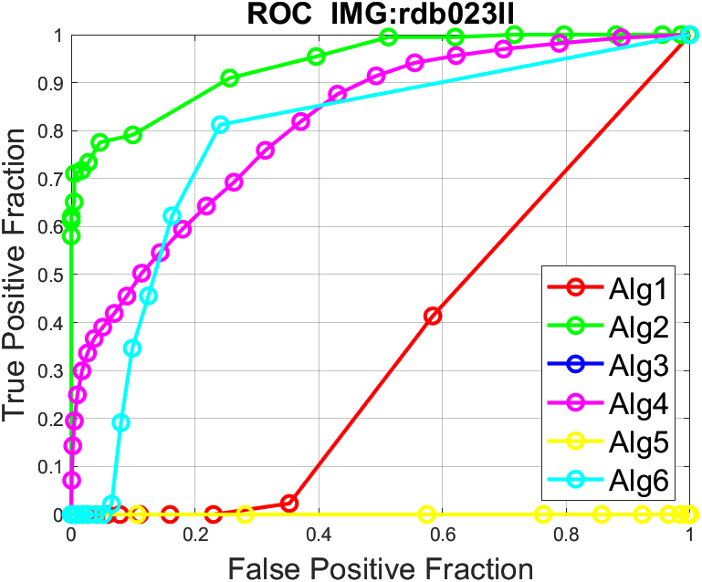
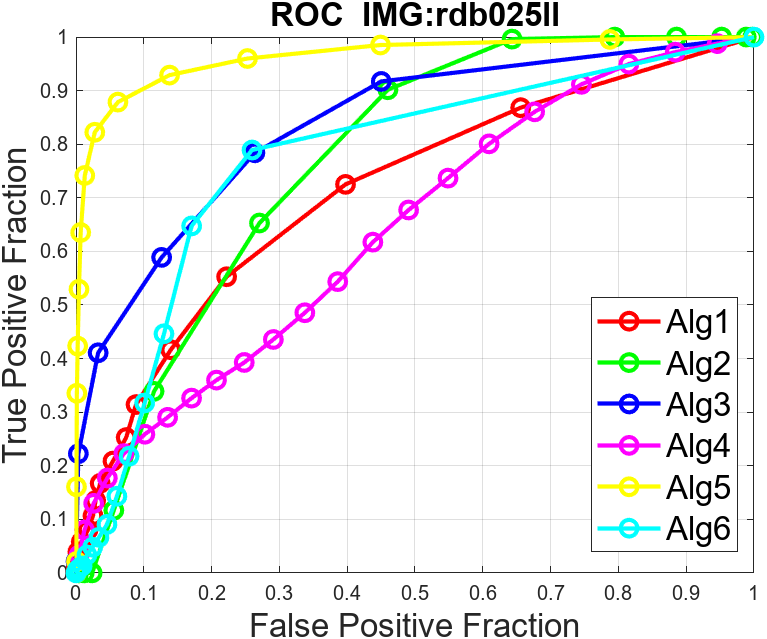

# Evaluation of CAD Algorithms

*Mohamed Ahmed Abdullah Mahmoud Mustafa*

**March 5, 2023**

---

## Introduction

The program evaluates and tests some algorithms and finds the best evaluation measure for it with different photos.

---

## The ROC Curves for All 4 Images

<!-- set image with linke (./Docs/src/rdb005ll.png) -->

|    |            | 
|----------|:-------------:|
  |  
  |  

---

## The Results of the 2D Evaluation

The best algorithm as 1 shows is **Alg3** because its AUC is larger than AUC of other algorithms, in addition to Jaccard and Dice similarity, and the Hausdorff Distance is smaller than other algorithms.

---

The best algorithm as 2 shows is **Alg2** because its AUC is larger than the AUC of other algorithms.

---

The best algorithm as 3 shows is **Alg5** because its AUC is larger than the AUC of other algorithms, in addition to its Jaccard and Dice distances is a 2nd smaller distance.

---

The best algorithm as 4 shows is **Alg5** because its AUC is larger than the AUC of other algorithms, in addition to its Jaccard and Dice distances is a 2nd smaller distance.

---

## The Results of the 3D Evaluation

---

## The Best Evaluation Measure

It depends on the input Data-set, There is no evaluation measure that is best for all cases, but each measure has some advantages and some disadvantages, and in general, the engineer must make a trade-off according to the application that he is about to evaluate.

## The Troubles I Have Encountered

- Dealing With Notebook in Matlab, the performance is prolonged.

- Can’t use built-in trapezoid function in Matlab.

- Calculating Confusion Matrix parameters for 3D evaluation in one line.
